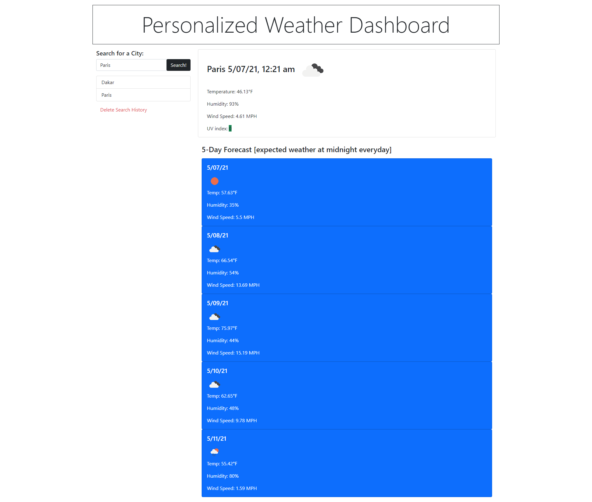

# Personalized-Weather-Dashboard

## About
This is a personalized Weather Dashboard for your use! 
•	Developed a web application that would let you personalize the weather that you would like to see and would save your recent searches. It would tell you the current temperature, humidity, wind speed as well as an icon to match. 
•	Used Open Weather API, Javascript, HTML, CSS, Bootstrap, Local Storage

Here is a direct link: https://anneliserowan.github.io/weather-dashboard/

## Demo 

